# Örder GUI

Good news! We're hired to develop the frontend of the Örder application!

The backend is already fully implemented, it can be found here:
- https://github.com/switchfully/order-solution-jpa
- You will need this backend.
- Clone the repository, read its `readme.md` and run the application locally.
    - Your frontend will have to use this backend's Web API (RESTful).

**Remark 1**:
Authentication or authorization are completely optional.
- Should you have an abundance of time, you can implement both authentication and authorization. 
    - Provide a registration and sign-in form / screen for this.
- This will also require changes on the backend...

## Story IT1: Item overview

**As a user I want to see an overview of all the items so that I can see what Items exist.**

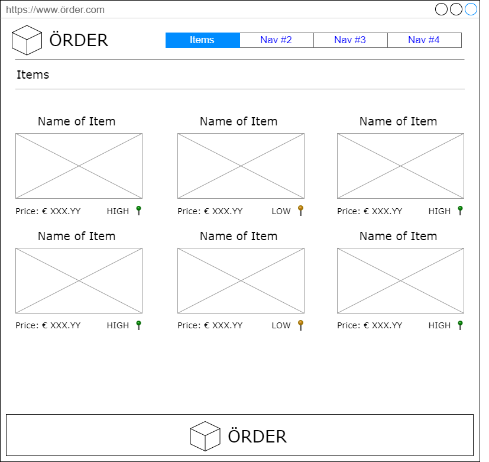

- Each Item should show:
    - Name
    - Price
    - A box that is a placeholder for an image
        - You can show a random image
    - The Stock urgency
        - Green == high
        - Orange == medium
        - Red == low
- _Pagination is not required_

## Story IT2: Item overview - Filter

**As a user I want to filter items in the overview of all the items so that I can more efficiently find an Item.**

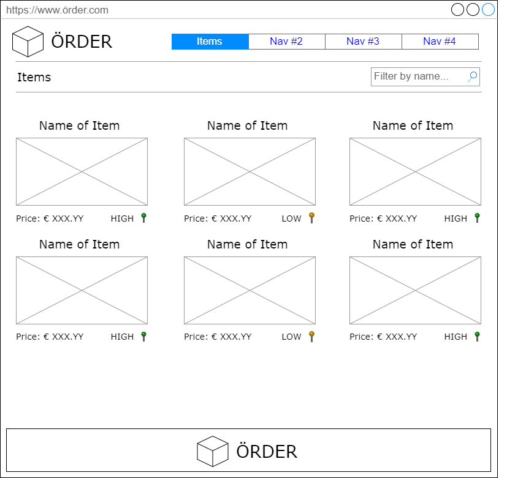
- Filter by name only
    - Filtering is not case-sensitive
    - Filtering is based-on a starts-with strategy.
- The filtering can be performed purely on the frontend side. 

## Story IT3: Create Item

**As a user I want to create an Item so that I can have more Items than I have now.**

- The following information should be provided for creating an Item:
    - Name
    - Description
    - Price
    - Amount of (initial) Stock
- Provide proper validation
    - Red text should provide quick feedback to the user what he did wrong.
    - Description can only be 255 characters or fewer.
    - Negative price or stock is not allowed.
- After successfully creating an item, redirect the user to the item detail page. 
    - This page might not yet exist, simply redirect to the url of the page then.
    
## Story IT4: Create Item - Length counter

**As a user I want to see how many characters I can enter for the description so that I know when I have provided too much text.**

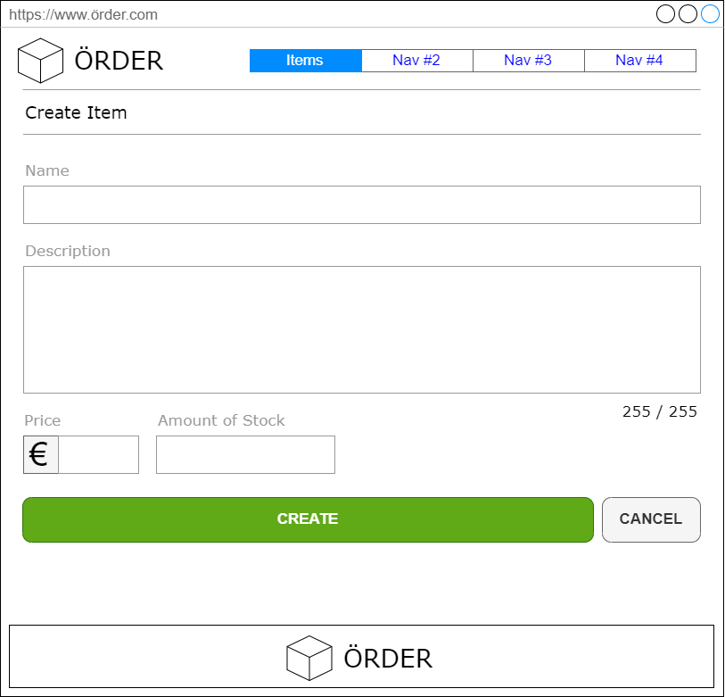

- Description can only have 255 characters.
    - For every character, the counter is reduced by 1
    - When 255 or more characters are entered, the counter remains 0 and becomes red
        - This should make the form element invalid.
- Clicking the Cancel button should automatically navigate back to the Item overview.
- Technical Tip:
    - Make the counter a reusable component or directive

## Story IT5: View Item Detail

**As a user I want to view one specific Item so that I can see its detailed information**

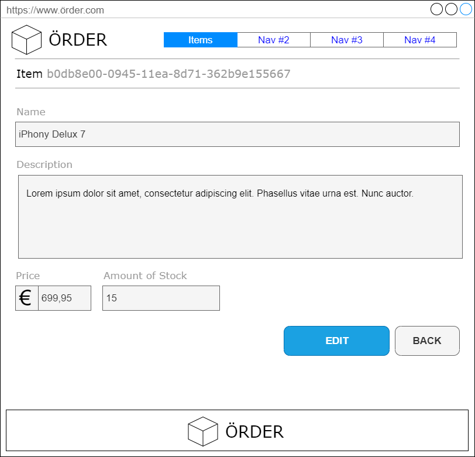

- We should be able to navigate to an Item's detail page:
    - By directly navigating to a url that contains the id of the item.
        - https://order-frontend-site.com/items/<id>
    - By clicking on an item's name or image in the item overview.
- The following information should be present on the item's detail page
    - Id
    - Name
    - Description
    - Price
    - Amount of (initial) Stock
- Clicking the Back button should automatically navigate back to the Item overview.
- No changes to the data can be made here, all contents is presented as labels or as read-only form elements
- You can already add the Edit button as a placeholder.

## Story IT6: Update Item

**As a user I want to update (edit) one specific Item so that I can keep its information up to date.**

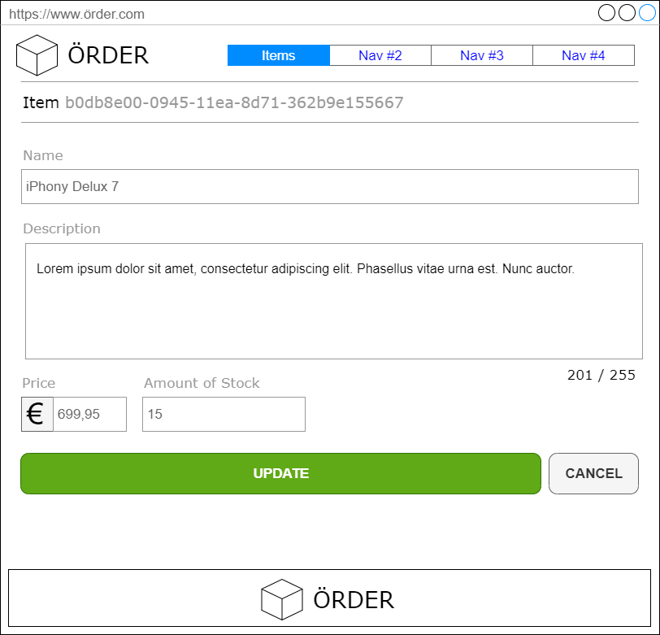

- The following information should be editable:
    - Name
    - Description
    - Price
    - Amount of (initial) Stock
- Make sure all validation rules still apply.
- The id should never be editable.
- Clicking the Cancel button should automatically navigate back to the Item Detail page.
- Additionally (not optionally):
    - Add an 'Edit' button on the Item detail's page that, upon being clicked, redirects to the item's edit page.
    - After updating the changes, redirect to the detail page, it should show the new changes.

## Story CU1: Customer overview

**As a user I want to see an overview of all the customers so that I can see what Customers exist.**

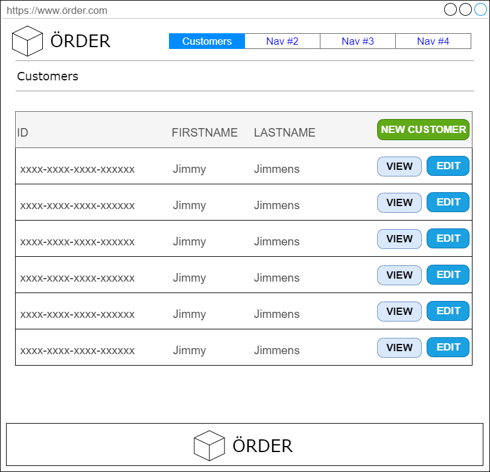

- For each customer, show:
    - Id
    - Firstname
    - Lastname
- The New Customer, View and Edit buttons can already be added (just as placeholders)
- _Pagination is not required_

## Story CU2: Customer overview - Filter

**As a user I want to filter customers in the overview of all the customers so that I can more efficiently find a customer.**

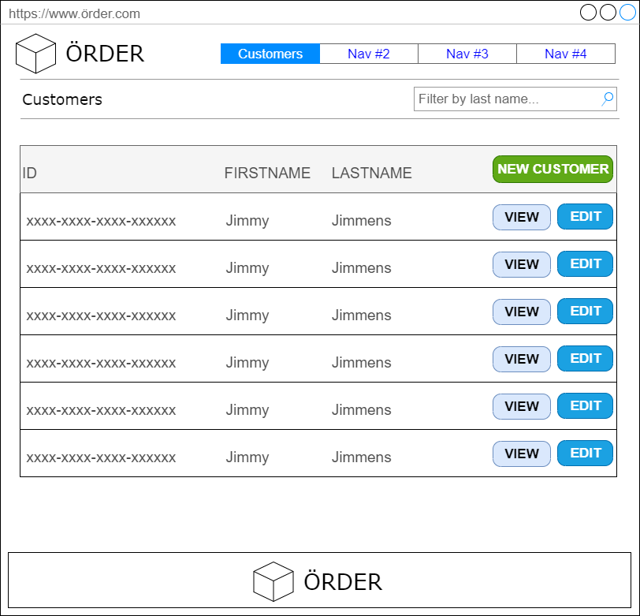
- Filter by lastname only
    - Filtering is not case-sensitive
    - Filtering is based-on a starts-with strategy.
- The filtering can be performed purely on the frontend side. 

## Story CU3: Create Customer

**As a user I want to create a Customer so that I can have more Customers than I have now.**

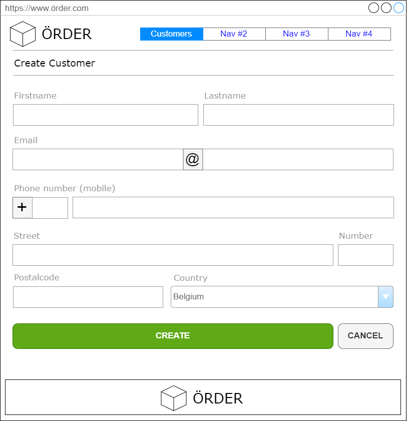

- The following information should be provided for creating a Customer:
    - firstName
    - lastName
    - email (value object)
    - address (value object)
        - For the country, provide a dropdown (purely frontend) that contains values:
            - Belgium
            - France
            - Germany
    - phoneNumber (value object)
- Provide proper validation
    - Red text should provide quick feedback to the user what he did wrong.
- After successfully creating a Customer, redirect the user to the Customer detail page. 
    - This page might not yet exist, simply redirect to the url of the page then.
    
## Story CU4: View Customer Detail

**As a user I want to view one specific Customer so that I can see its detailed information**

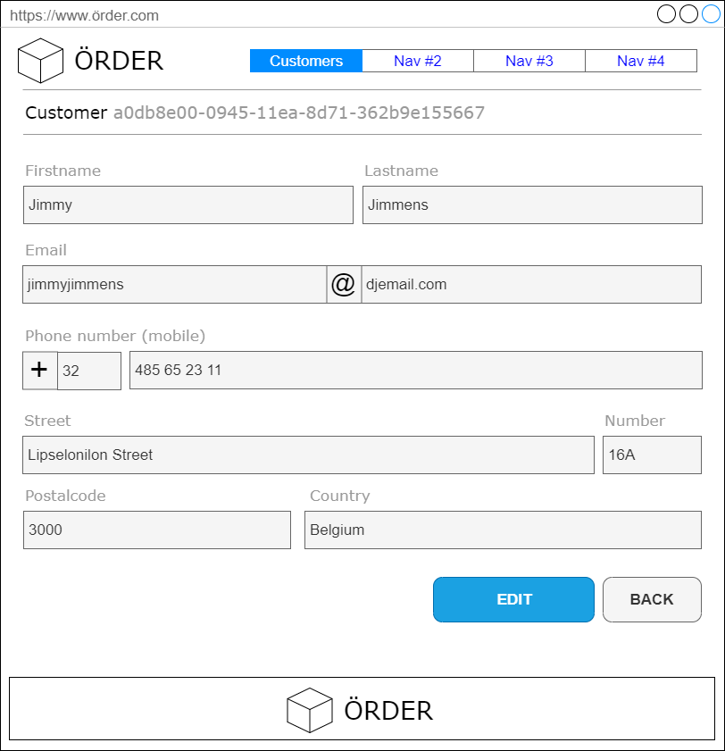

- We should be able to navigate to a Customer's detail page:
    - By directly navigating to the url that contains the id of the customer.
        - https://order-frontend-site.com/customers/<id>
    - By clicking on a customer's id or on the view button in the customers overview.
- The following information should be present on the customer's detail page
    - firstName
    - lastName
    - email (value object)
    - address (value object)
    - phoneNumber (value object)
- Clicking the Back button should automatically navigate back to the Customer overview.
- No changes to the data can be made here, all contents is presented as labels or as read-only form elements
- You can already add the Edit button as a placeholder.

## Story CU5: Update Customer

**As a user I want to update (edit) one specific Customer so that I can keep its information up to date.**

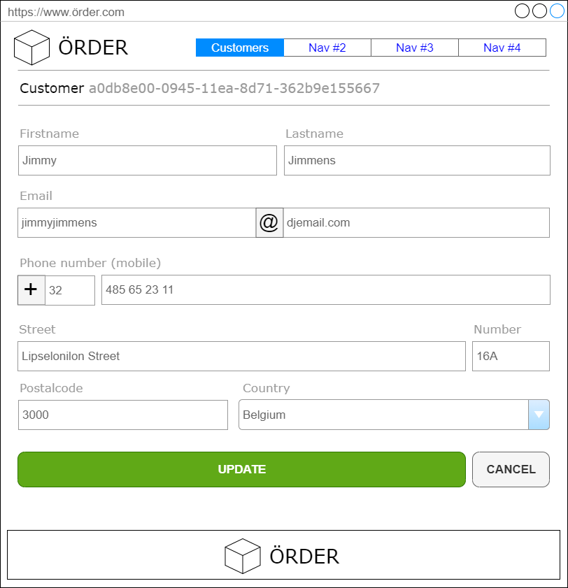

- The following information should be editable:
    - firstName
    - lastName
    - email (value object)
    - address (value object)
    - phoneNumber (value object)
- Make sure all validation rules still apply.
- The id should never be editable.
- Clicking the Cancel button should automatically navigate back to the Customer Detail page.
- Additionally (not optionally):
    - Add an 'Edit' button on the Item detail's page that, upon being clicked, redirects to the customer's edit page.
    - In the overview of the customers, make sure that the edit buttons go to the edit page of that customer.
    - After updating the changes, redirect to the detail page, it should show the new changes.

## Story ORBA1: Shop for Items

**As a user I want to add Items to my basket so that I can keep an overview of the items I am going to order (before ordering them).**

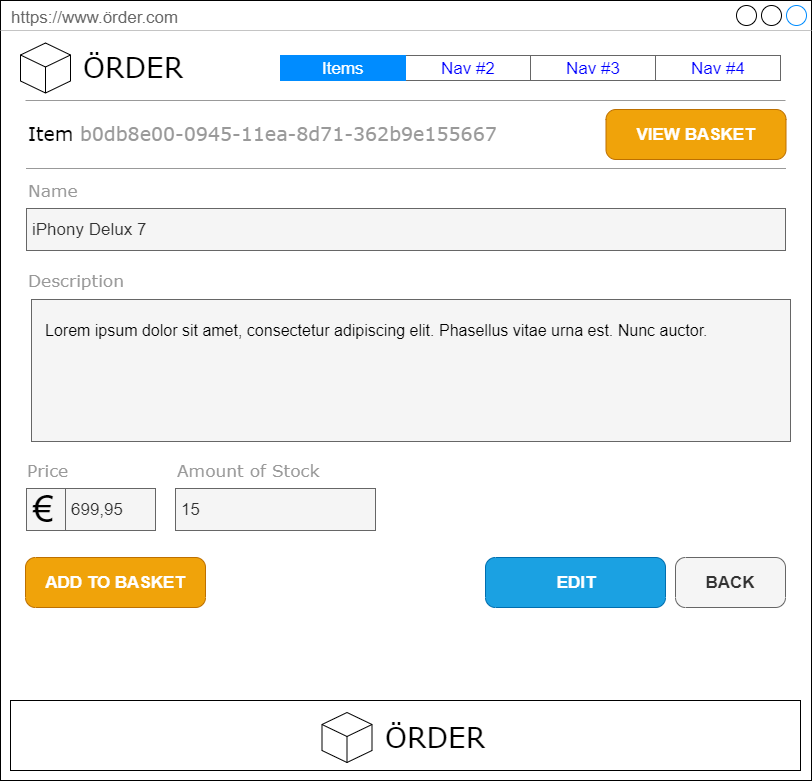

- Every item should have an Add to Basket button, this will add (1 amount of) the Item to the basket
    - Out of Stock items can still be added.
- Technical tip: Keep the Basket in a singleton service or localStorage
- When an Item is added to the basket, give some kind of visual feedback to the user that this happened.
- Every Item should have a View Basket button (for now, just a placeholder) 

## Story ORBA2: View Basket

**As a user I want to view my basket so that I can see the items I am going to order (before ordering them).**

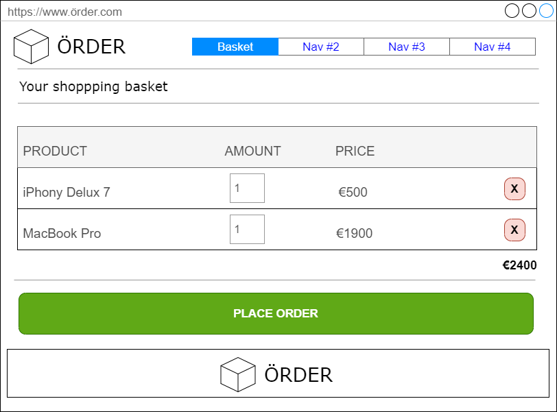

- For every item added to the basket, display the name and the amount to order and the price.
    - The amount to order can be changed into a higher value (by default it is value 1)
    - The displayed price is amount * unit price
- Also display a total price of the whole basket
- All the displayed prices are just informational. They will not be send to the backend.
- Every item should have a 'remove' button, this will remove the item from the basket.
- The basket should have a Place Order button (for now, just a placeholder) 

## Story ORBA3: Place Order

**As a user I want to use my basket to place an order.**

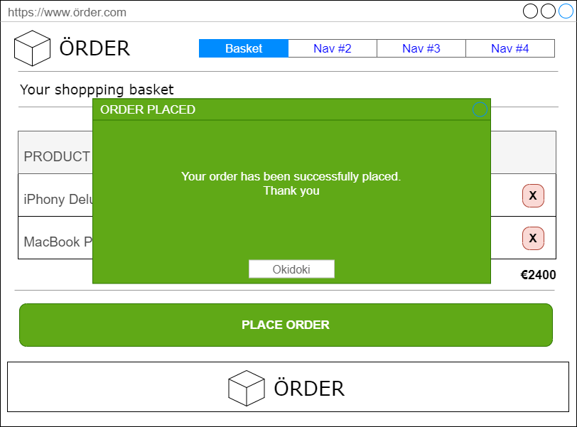

- After clicking the Place Order button, and the order was successfully registered on the backend, provide the 
user with a dialog to inform him/her about the fact that the placement of the order was successful.
- The basket should automatically be cleared.
- Automatically navigate to the items overview.
- (If the order should not be successful, inform the user!)  

# Nice to Have stories

## Story OR1: Overview of orders

Show an overview of all the orders.
- Be inspired by - and base yourself on - the stories for the overview of the items and customers 

## Story OR2: Order report

For a specific customer, show in a visual appealing way, all of its orders (the report).

## Story CUPAG1: Pagination

Provide for the overview of customers pagination
- It can be pagination that's only available on the frontend
    - Thus, you get all the customers from the backend, but then paginate them on the frontend
        - (in reality: you will want to perform backend pagination as well)

Try to turn the pagination into a reusable component that can also be used for the overview of the items. 
